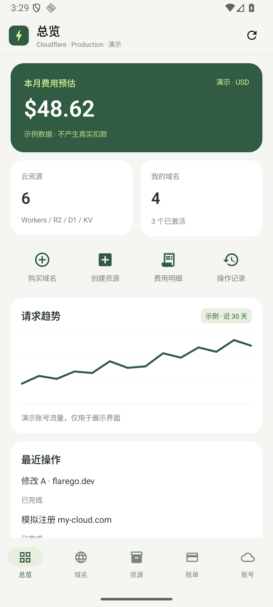
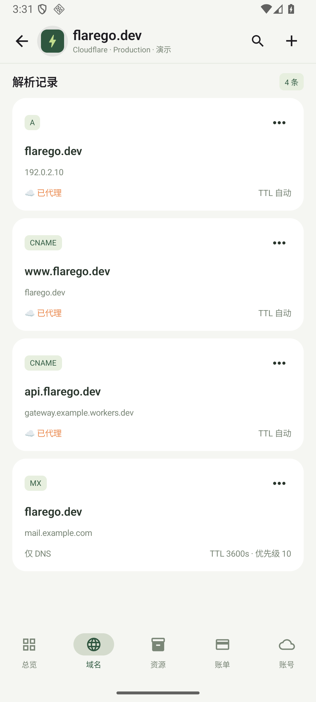
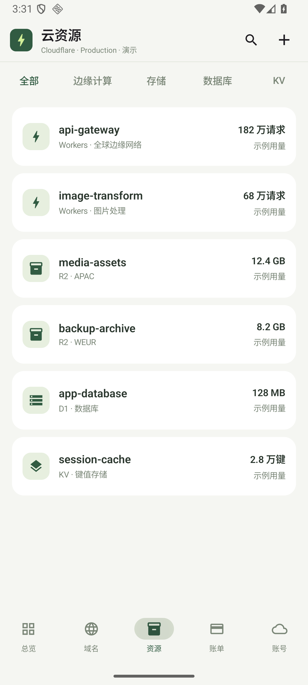
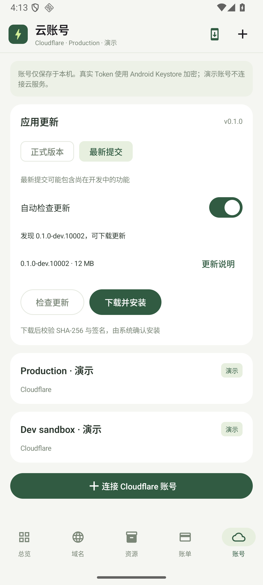
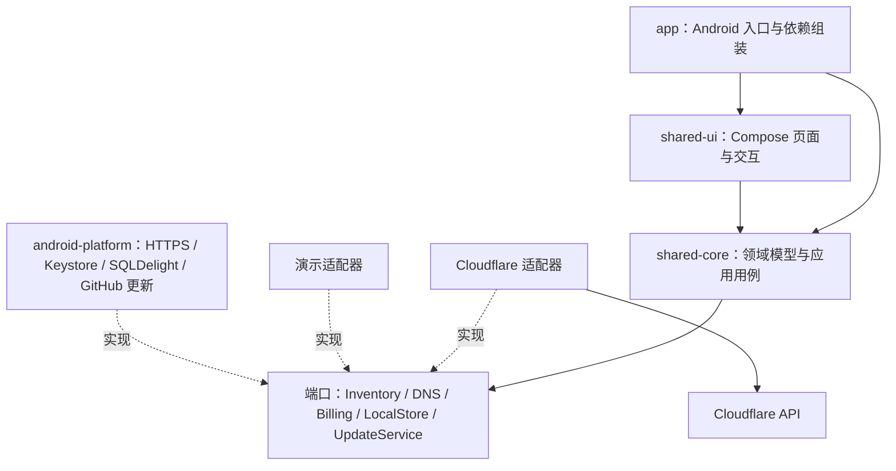

<p align="center">
  
</p>

<h1 align="center">FlareGo</h1>

<p align="center">手机上的多云资源管理助手。</p>

<p align="center">
  <a href="https://github.com/SatoriTours/FlareGo/releases/latest">下载 APK</a> ·
  <a href="https://github.com/SatoriTours/FlareGo/releases">版本列表</a>
</p>

## 界面预览

以下为原生 Android 模拟器截图。云资源、金额和趋势来自演示账号，供体验交互使用。

| 总览 | DNS 解析 | 云资源 | 应用更新 |
| --- | --- | --- | --- |
|  |  |  |  |

界面围绕日常操作设计：

- 标题栏显示当前页面、域名或资源名称，详情直接进入内容。
- 搜索位于标题栏右侧，点击图标后展开输入框。
- 点击闪电 Logo 打开云账号抽屉，可左滑关闭；切换账号时保留当前功能入口，并清空旧账号的详情与搜索。
- 底部提供总览、域名、资源、账单、账号五个入口。
- DNS 和资源使用紧凑列表；变更前展示确认信息，结果写入本机操作记录。

更多截图见 [design](design)，交互说明见 [UI 设计文档](docs/ui-design.md)。

## 获取 APK

**提交构建**：打开 [Android Actions](https://github.com/SatoriTours/FlareGo/actions/workflows/android.yml)，选择成功的分支构建，在 Artifacts 下载 `flarego-signed-android-<运行编号>`，解压后安装 APK。下载 Actions artifact 需要登录 GitHub，产物默认保留 30 天。

**已发布版本**：在 [Releases](https://github.com/SatoriTours/FlareGo/releases) 下载 APK。正式版附件为 `flarego-<版本号>.apk`；明确发布的测试版位于 `latest`，附件为 `flarego-latest.apk`。

普通提交只生成签名构建产物，**不会创建或移动 Tag，也不会发布 Release**。正式版和测试版发布均需要明确触发，见 [构建与发布](#构建与发布)。

运行要求：Android 8.0 / API 26 或更高。提交构建和发布构建共用同一签名证书，可在版本号更高时覆盖安装；本地 Debug 使用不同证书。

## 快速开始

### 体验演示账号

安装后默认进入演示账号，无需填写任何云服务凭据。可以浏览域名和资源，尝试搜索、账号切换、DNS 编辑以及域名购买确认。演示操作只改变本机示例状态，不连接真实云服务。

### 连接 Cloudflare

1. 打开 FlareGo 的「账号」，点击「连接 Cloudflare 账号」或标题栏的 `+`。
2. 点击「获取 API Token」，浏览器会打开 [Cloudflare API Tokens 页面](https://dash.cloudflare.com/profile/api-tokens)。选择 `Create Token` → `Create Custom Token`，按需配置权限并限定账号和 Zone 范围；Token 仅显示一次，请及时复制，不要使用 Global API Key。「查找 Account ID」可打开官方获取说明。
3. 返回 App，输入账号名称、Account ID 和 API Token；验证通过后保存连接。
4. 点击闪电 Logo，从抽屉选择对应账号，再进入域名、资源或账单页。

Account ID 是 32 位十六进制字符串。建议从读取权限开始：账号访问可使用 `Account Settings Read`，域名列表需要 Zone 读取权限；修改 DNS 时再添加 DNS 写权限。Workers、R2、D1、KV 按需授予对应读取权限。权限名称和范围以 [Cloudflare 权限文档](https://developers.cloudflare.com/fundamentals/api/reference/permissions/) 及 [账号接口要求](https://developers.cloudflare.com/api/resources/accounts/methods/get/) 为准。

每项资源独立处理权限不足，不会因为某个产品不可访问而隐藏其他已授权资源。账单读取使用用户级历史接口，取决于 Token 和用户权限；无法读取时提供官方控制台入口。

## 功能范围

| 功能 | 当前实现 |
| --- | --- |
| 云账号 | 验证、连接、切换、断开多个 Cloudflare 账号；本机加密保存 Token |
| 域名 | 查询当前账号的 Zone 列表，支持分页和搜索 |
| DNS | 查询、新增、编辑、删除解析记录；确认后提交；展示代理状态与 TTL |
| 边缘计算 | 查询 Workers 目录与资源详情元数据 |
| 存储与数据库 | 查询 R2 桶、D1 数据库、KV 命名空间目录与详情元数据 |
| 账单 | 读取用户级历史账单；区分用户范围和当前账号范围 |
| 操作记录 | 保存本机操作结果；网络中断等不确定结果标记为待核对 |
| 应用更新 | 正式／测试通道、自动／手动检查、下载校验、系统安装确认 |

真实域名注册、资源创建、Worker 部署以及 R2 对象读写目前通过官方控制台完成。域名搜索和购买确认在演示账号中提供模拟流程。其他云厂商尚未接入。

真实连接不会用示例数据补齐缺失结果；没有可用预估费用时显示未知。用户级账单可能包含其他账号，不能作为当前账号的月度费用汇总。当前 API 行为通过隔离测试验证，尚未使用真实云账号完成端到端验收。

## 凭据与操作

- API Token 使用 Android Keystore 与 AES/GCM 加密保存，不进入 SQL 数据库或应用日志。
- 账号元数据和操作记录保存在本机 SQLDelight 数据库；Token 输入页禁止系统截图，系统备份与设备迁移已禁用。
- 未提交的连接草稿只暂存在内存，Activity 重建后仍可继续填写；取消或验证成功后清空，进程结束后不会恢复未提交的 Token。
- 云请求固定发送到 Cloudflare HTTPS API，不携带 Token 跟随重定向。
- 写请求禁止自动重试。出现超时或断连时保留待核对结果，再读取云端状态，避免重复提交。
- DNS 变更先预览再确认；切换账号后，旧请求结果不会覆盖新账号的数据。

断开账号会清理该账号的本机连接、凭据和操作记录；卸载应用只清理本机数据。二者都不删除云端资源。

## 架构

采用 **Clean Architecture + Ports & Adapters**：共享业务定义端口，云厂商和 Android 平台提供实现，UI 消费应用状态与操作意图。

项目采用 Kotlin Multiplatform 与 Compose Multiplatform。目前提供 Android 客户端，业务核心同时支持 Android 和 JVM；其他平台入口及云厂商适配器仍在规划中。



```text
app/                 Android 入口、ViewModel、依赖组装与系统安装流程
shared-ui/           Compose 主题、导航、页面、表单和更新界面
shared-core/
  application/       用例、账号隔离、操作状态与 DNS 校验
  model/             领域模型
  ports/             云服务和本地存储接口
  cloudflare/        Cloudflare API 适配器
  demo/              演示数据和模拟操作
  updates/           更新契约、版本校验与状态控制器
android-platform/    HTTPS、凭据加密、数据库、更新下载和 APK 验证
tools/ci/            构建版本、签名准备、校验文件和显式发布脚本
design/              设计稿与原生截图
docs/                架构、界面、实现范围和发布说明
```

核心业务不依赖 Android 或 Compose，页面不依赖 Cloudflare API 的原始 DTO。新增云厂商时实现相应能力端口并在入口注册；DNS、对象存储、虚拟机和边缘函数分别建模，保留厂商的产品差异。

当前采用客户端直接调用云 API 的方式，没有部署独立后端。团队协作、后台同步和任务执行器属于未来扩展，详见 [整体架构](docs/architecture.md)。

## 本地开发

### 技术栈与环境

| 项目 | 版本／要求 |
| --- | --- |
| Kotlin / Kotlin Multiplatform | 2.3.20 |
| Compose Multiplatform | 1.10.1 |
| SQLDelight | 2.3.2 |
| OkHttp | 4.12.0 |
| Gradle Wrapper / Android Gradle Plugin | 9.1.0 / 9.0.1 |
| Java | JDK 17 |
| Android SDK | Platform 36、Build Tools 36.0.0；minSdk 26、targetSdk 36 |

使用 Android Studio 打开仓库，配置 Android SDK 后运行 `app`。命令行开发：

```sh
git clone https://github.com/SatoriTours/FlareGo.git
cd FlareGo
# 配置 ANDROID_HOME，或在 local.properties 中填写 sdk.dir
./gradlew :app:assembleDebug
```

Debug APK 位于 `app/build/outputs/apk/debug/app-debug.apk`。`local.properties` 和私钥文件不提交到仓库。

### 验证

```sh
# 构建、核心／平台单元测试和 lint
./gradlew :shared-core:jvmTest :android-platform:testDebugUnitTest \
  :app:assembleDebug :app:lintDebug :android-platform:lintDebug

# 启动模拟器或连接测试设备后运行原生测试
./gradlew :app:connectedDebugAndroidTest

# 发布规则、版本和元数据契约
python3 -m unittest discover -s tools/ci/tests -v
```

测试覆盖账号切换和过期请求、DNS 校验、权限隔离、分页、写请求不重放、凭据与数据库持久化，以及更新通道、节流、文件完整性和安装前校验。测试不需要云 Token，不执行真实云写操作。[签名升级验证记录](docs/release-verification.md) 保存了隔离模拟器上的实际验证结果。

### 设计原型

仓库保留 HTML 可点击原型，便于讨论界面与架构。需要 Python 3；通过 npm 启动时还需要 Node.js：

```sh
npm run dev
# 或直接运行
python3 -m http.server 4173 --bind 127.0.0.1
```

打开 `http://localhost:4173`。`design-board.html` 展示主要页面，`architecture.html` 展示架构图。原型使用独立演示状态，Android App 通过原生 Compose 运行。

## 构建与发布

| 触发方式 | 结果 |
| --- | --- |
| Pull request | 单元测试、lint 和 Debug 编译；不使用发布密钥 |
| 分支提交，包括 main | 检查、签名 APK、元数据和 SHA-256；上传 Actions artifact |
| 手动运行，保持默认选项 | 同普通提交，仅生成构建产物 |
| 明确创建并推送 `vMAJOR.MINOR.PATCH` Tag | 构建签名 APK并发布同名正式 Release |
| main 手动运行并明确勾选 `publish_snapshot` | 发布测试版到 `latest`，创建或移动该滚动 Tag |

**日常开发只提交代码。打 Tag 和发布版本是单独的操作，需要明确决定。** 已发布的正式版本不会被重跑覆盖；旧 main 提交不能替换较新的测试发布。

构建签名使用 GitHub Actions Secrets 中的独立发布密钥，普通构建任务只有仓库读取权限。发布任务单独申请写权限，并在脚本中再次验证明确的发布意图。签名配置、版本规则和维护步骤见 [发布说明](docs/releases.md)。

## 应用内更新

「账号 → 应用更新」默认检查正式版本，可切换到「最新提交」测试通道。测试通道读取最后一次**明确发布**到 `latest` 的构建；普通提交 artifact 不会自动成为 App 更新。

自动检查间隔六小时，偏好和上次尝试时间跨进程保存；手动检查不受间隔限制。公开 GitHub 更新无需 GitHub Token，也不会发送云服务 Token。

下载后校验大小和 SHA-256；安装前再次核对文件、包名、版本、最低 Android 版本及签名，并阻止降级。下载状态由 ViewModel 持有，屏幕旋转可继续流程。最终由 Android 系统安装器确认安装。

## 后续方向

- Cloudflare 深度管理：真实域名注册、Workers 部署、R2 对象、D1／KV 数据操作。
- 补充证书、缓存、安全规则、用量、订阅和费用能力。
- 接入 AWS、Google Cloud、Microsoft Azure、阿里云与腾讯云适配器。
- 根据需求扩展桌面／iOS 客户端，以及可选的后台同步与团队协作。

以上为路线方向，当前可用范围以本 README 的功能表和 [原生实现规格](docs/native-spec.md) 为准。

## 参与项目

欢迎通过 [Issues](https://github.com/SatoriTours/FlareGo/issues) 提交问题或建议，通过 Pull Request 贡献代码。问题报告请说明应用版本、Android 版本、操作步骤和预期结果；示例与截图使用演示数据，移除 Token 和账号敏感信息。

新增厂商或功能时，保持业务端口与平台实现的边界，并验证权限不足、切换账号、请求失败和不确定写入结果等路径。新增能力与对应验证完成后，再更新功能表。

## 许可证

本项目采用 [Apache License 2.0](LICENSE)。FlareGo 是独立项目，与 Cloudflare 及其他云厂商没有官方关联。
