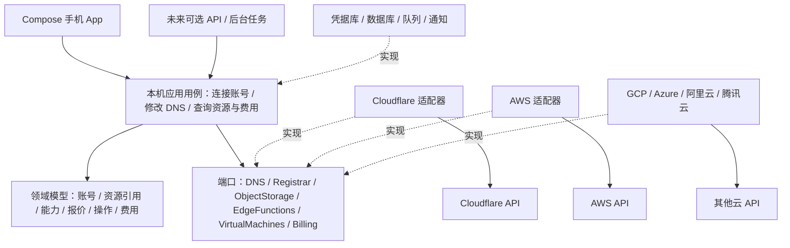
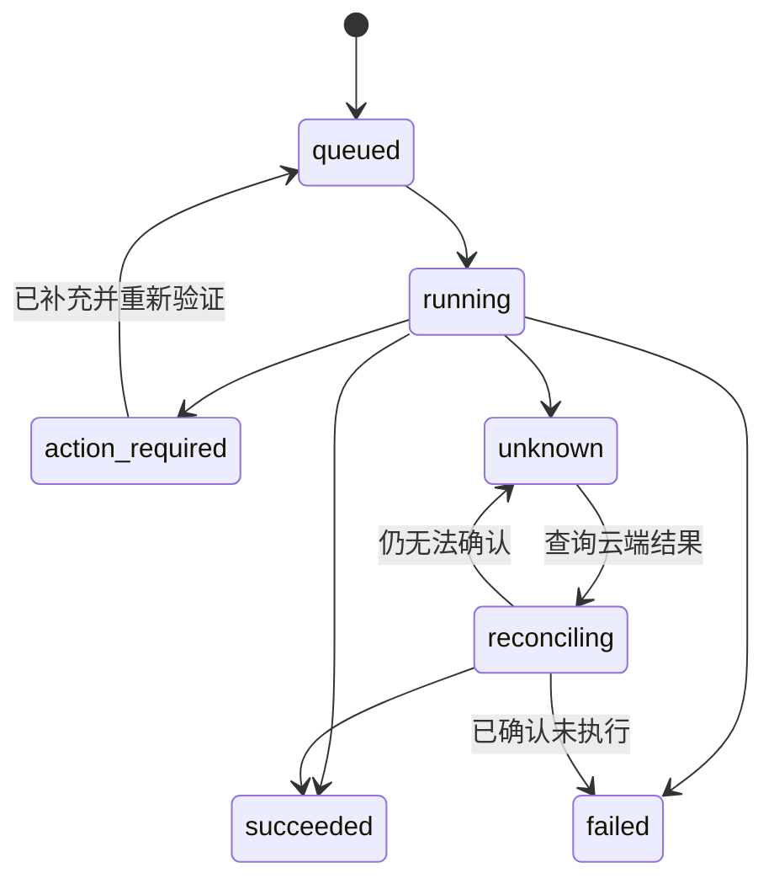

# FlareGo 架构方案

设计日期：2026-10-07。目标是个人多云管理 App，先完整跑通 Cloudflare 的高频操作，再扩展 AWS、Google Cloud、Azure、阿里云与腾讯云。默认主要终端是手机，桌面可以使用同一套产品信息架构。当前仓库已按用户确认的 dreamtools 技术栈实现原生 Android 首版，并保留设计原型。后端服务、完整 Registrar 注册和多云适配为后续扩展。具体实现范围见 [原生规格](native-spec.md)。

## 1. 核心决策

采用 **Clean Architecture + Ports & Adapters + 模块化单体**。业务用例定义需要的接口，厂商适配器、数据库、HTTP 框架实现接口，所有代码依赖指向业务内部。个人首版由本机 Kotlin 应用用例直接调用云 API，使用本机 Keystore 与 SQLDelight。未来增加团队协作或后台同步时，再引入独立 API 服务与任务执行器；下文 API、队列和工作区设计描述这个扩展方案。

App 默认工作范围是当前云厂商与账号，Logo 菜单承载低频的云与账号切换；各页面的搜索限定在当前范围。跨云聚合是后续显式选择的视图，不默认混合日常操作上下文。

统一的是账号、资源识别、操作生命周期、权限描述、费用与 UI 导航。DNS、对象存储、虚拟机、边缘函数分别有自己的接口。通用目录只能用于发现和浏览，不能靠一个万能 `ResourceService.execute(action, any)` 承载全部写入。

**共同能力统一，产品差异保留**：对象存储可以统一列桶、浏览对象和签名传输；R2 的公开域名、S3 的具体存储等级是产品模块。Workers 的版本、绑定和路由属于边缘函数；EC2 的启动、停止和磁盘属于虚拟机。两者不能通过同一个“启停节点”接口表达。



实线表示调用，虚线表示实现内层定义的接口。业务层不 import Android、Compose 或数据库驱动；Android 启动入口负责依赖注入。App 内遵循 Compose UI → ViewModel → AppController 用例 → DNS / Inventory / Billing 端口 → 厂商适配器的方向。

## 2. 原生技术与可选后端

当前原生模块采用 Kotlin 2.3.20、Compose Multiplatform 1.10.1、AGP 9.0.1、SQLDelight 2.3.2，与 dreamtools 的工程技术一致。Android minSdk 26、compile / target SDK 36。共享核心同时编译 Android 和 JVM；iOS / 桌面入口尚未建立。AGP 9 的应用入口使用内置 Kotlin，共享模块使用独立 Android KMP 插件。[Android 官方迁移说明](https://developer.android.com/build/migrate-to-built-in-kotlin)。

表中服务端部分是未来扩展建议，当前没有部署后端。

| 部件         | 建议                                        | 取舍                                                                                                                         |
| ------------ | ------------------------------------------- | ---------------------------------------------------------------------------------------------------------------------------- |
| 手机 App     | Kotlin + Compose Multiplatform            | Android 已实现；KMP 共享业务与 UI，为未来其他平台保留边界                          |
| 桌面入口     | 未来 Compose Desktop / 现有 HTML 设计参考                 | 共享契约、设计 token 和客户端用例；手机与桌面分别组织布局                                                                    |
| API / 业务层 | 未来独立服务 / 执行器，端口保持一致              | 便于先接入 Cloudflare；核心代码仅使用端口与平台无关类型                                                                      |
| 关系数据     | 首期 D1，封装 Repository                    | 连接、资源快照、操作、预算、审计均需要持久化；未来可切 PostgreSQL                                                            |
| 异步任务     | Queues + 消费 Worker，任务状态存于数据库    | [Queues](https://developers.cloudflare.com/queues/) 提供消息处理与重试；按至少一次投递设计消费幂等                           |
| 串行协调     | 按连接与操作键的 Durable Object，按需要引入 | [Durable Objects](https://developers.cloudflare.com/durable-objects/) 适合有状态协调；防止同一域名重复购买或同一资源并发变更 |
| 文件与产物   | R2，封装 BlobStore                          | 保存账单导入文件、导出结果、构建产物；大文件走临时授权链接                                                                   |
| 定时同步     | 调度器 → 队列 → 厂商适配器                  | 前台读缓存快照，手动刷新触发任务，避免每次页面打开抓取所有产品                                                               |
| 密钥         | 凭据加密服务 + 独立根密钥 / KMS 策略        | 数据库只存密文与密钥版本；根密钥独立托管，授权执行器短暂解密                                                                 |

Workers 的 Node.js 兼容能力有范围限制，不能假定任何云 SDK 或长连接机制都能直接运行。[Node.js compatibility](https://developers.cloudflare.com/workers/runtime-apis/nodejs/) 是实际接入时的验证依据。新厂商 SDK 如果依赖未支持的运行时能力，将对应任务执行器部署到普通 Node 容器；API、业务用例和 App 契约无需因此改变。控制面部署故障与云端业务运行分开处理：FlareGo 不应进入所管理业务服务的请求路径。

个人版本先完成单用户工作区；表结构保留 workspace_id。登录、权限和隔离是基础能力，团队邀请、审批链和复杂角色放在后续。

## 3. 模块、端口与适配器

| 模块                   | 内层端口 / 用例                                        | Cloudflare 首期                                 | 多云扩展原则                                                      |
| ---------------------- | ------------------------------------------------------ | ----------------------------------------------- | ----------------------------------------------------------------- |
| Identity / Connections | VerifyConnection、DiscoverAccounts、CredentialResolver | API Token 验证、账号 / Zone 范围发现            | 各厂商使用适合的角色、联合身份或短期凭据；由适配器负责授权流程    |
| Inventory              | ListResources、GetResource、SyncInventory              | Zones、Workers、R2、D1、KV                      | 最小统一目录 + 产品详情 DTO；账号、项目、订阅、区域都是显式 scope |
| Domains                | RegistrarPort + DnsPort                                | 域名列表、搜索 / 购买、DNS CRUD                 | 注册商、DNS Zone、子域三者独立建模；DNS 可托管第三方购买域名      |
| Storage                | ObjectStoragePort、KvPort、SqlDatabasePort             | R2 桶 / 对象、KV、D1                            | 对象、KV、SQL 分开；数据库引擎与备份能力用产品模块扩展            |
| Compute                | EdgeFunctionsPort、VirtualMachinesPort、ContainersPort | Workers 概览、版本、路由、绑定；Containers 后续 | VM、容器与边缘函数是不同资源类型；计量口径独立                    |
| Networking / Security  | CertificatesPort、RulesPort、NetworkPort               | SSL / TLS、DNSSEC、缓存 / WAF 分批接入          | 各厂商差异较大，提供原生产品扩展；不虚构一致的规则语义            |
| Billing                | UsagePort、CostPort、InvoicePort、SubscriptionPort     | 账单历史、可用用量、订阅；按授权开放            | 预估与实收区分，币种独立；缺失数据不可当作零                      |
| Operations             | Plan / Confirm / Execute / Reconcile                   | 所有变更、购买、部署共用任务中心                | 云厂商不同状态统一映射，但保留原始状态与错误                      |
| Notifications          | BudgetAlert、ExpiryAlert、JobResult                    | 预算、域名到期、操作结果                        | App 推送 / 邮件是输出适配器，预算提醒不等于硬性限额               |

Cloudflare 的边缘函数与容器具有不同运行与部署模型，首期不要把“计算节点”理解成传统 EC2 实例。[Workers 运行机制](https://developers.cloudflare.com/workers/reference/how-workers-works/)、[Containers 概览](https://developers.cloudflare.com/containers/) 支持这一产品区分。

注册表返回 `ProviderAdapter`，按能力组合多个小端口。UI 接收能力描述而非业务层的类对象：

```ts
{
  key: "registrar.register",
  availability: "available", // available | permission_required | unsupported | console_only | temporarily_unavailable
  permissions: ["Registrar Write"],
  reason: undefined,
  constraints: { supportedExtensions: "runtime-discovery" }
}
```

静态支持列表与账号实际可用能力分开：产品存在，不代表 Token 有权限、账号套餐支持、区域开放或该后缀可注册。每个按钮都依照账号授权、目标资源和当前数据验证。多云未支持操作应给出原因和适用的官方入口；凭据失效仅影响所属连接。

UI 产品模块使用受信任、随版本发布的模块注册，不在 App 内下载任意厂商代码执行。扩展由 `resourceType + capabilityKey + typed payload` 路由，DTO 通过版本化 schema 校验。

### Cloudflare 产品覆盖目录

以产品能力矩阵推进管理范围，而不是把「支持 Cloudflare」视为已经支持所有 API。

| 产品组                                  | 目标管理内容                                               | 建议优先级                          |
| --------------------------------------- | ---------------------------------------------------------- | ----------------------------------- |
| Registrar / DNS / Zones                 | 域名搜索购买、到期与自动续费、托管域名、解析、DNSSEC       | 第一闭环；购买按 Beta 实际授权验证  |
| Workers / Pages                         | 函数与站点、路由、绑定、版本、部署、触发器、请求指标与日志 | 高频资源管理                        |
| R2 / KV / D1                            | 桶与对象、访问策略、键值读写、数据库、用量与备份           | 高频资源管理；数据操作分别授权      |
| SSL / TLS / CDN / Cache                 | 证书、加密模式、缓存配置与清理、站点统计                   | Cloudflare 深度覆盖                 |
| WAF / Rules / Rate limiting             | 安全规则、流量规则、访问控制与事件                         | Cloudflare 深度覆盖；先预览变更影响 |
| Queues / Durable Objects / Workflows    | 队列、持久对象与工作流状态、配置和用量                     | 开发者平台扩展                      |
| Containers / Workers AI / Vectorize     | 容器部署与实例、AI 调用与计量、向量索引                    | 独立产品详情；按开放能力接入        |
| Load Balancing / Tunnel / Zero Trust    | 流量入口、隧道、身份与网络访问策略                         | 网络与安全扩展                      |
| Billing / Subscriptions / Notifications | 用量、费用、订阅、发票、到期和预算提醒                     | 从可读取账单开始，能力分开检测      |

此表是产品覆盖设计，不承诺每项均有可用写入 API。每个产品还需逐操作维护「API 可用 / 权限不足 / 官方处理 / 未支持」矩阵；首期实现与未来计划在 UI 中明确区分。厂商账号的具体覆盖以已验证接口、权限和套餐为准。完整 API 产品目录可参考 [Cloudflare API Reference](https://developers.cloudflare.com/api/)。

## 4. 关键数据模型

| 模型                    | 关键字段与约束                                                                                                                                                           |
| ----------------------- | ------------------------------------------------------------------------------------------------------------------------------------------------------------------------ |
| Workspace / Membership  | 用户自己的空间；每次读取、变更、后台任务都核验 workspace_id                                                                                                              |
| CloudConnection         | provider、credentialRef、displayName、state、lastVerifiedAt；与 cloud account 一对多                                                                                     |
| CloudScope              | account / project / subscription、region、zone；均保留厂商原生 ID，全球资源显式标为 global                                                                               |
| ResourceRef / Snapshot  | workspaceId、connectionId、provider、scope、resourceType、externalId；这一组合决定唯一性。name 仅用于展示；observedAt、syncStatus、version、nativeMetadata 带独立 schema |
| DomainRegistration      | 注册商、注册域名、到期时间、自动续费、注册状态；未购买但托管 DNS 的域名也能存在                                                                                          |
| DnsZone / DnsRecord     | 与 Registration 分开；type、name、content、ttl、priority；proxyEnabled 是 Cloudflare 扩展                                                                                |
| Quote / ChangePlan      | resourceRef、inputHash、amount 为十进制字符串、currency、期限、条款、报价来源、expiresAt；购买前重新核价                                                                 |
| Operation               | actor、account、typedAction、inputHash、idempotencyKey、planId、status、providerRequestId、attempts、progress、lastError、traceId；持久化状态机                          |
| CostEntry / Invoice     | source、currency、decimalAmount、period、service、granularity、isEstimated、observedAt、coverage；发票与用量条目分开                                                     |
| Budget                  | period、currency、scope、amount、alertThreshold；不提供硬性停机承诺                                                                                                      |
| SyncCursor / AuditEvent | 每个产品和 scope 独立 cursor；审计包含变更前后差异、操作者与结果，敏感值脱敏                                                                                             |

金额不使用浮点数计算；适配器保留原币种。跨 USD / CNY 的合计只有在明确选择汇率来源、时间与目标币种后才显示，并标为折算值。总费用与资源分摊不重复计入，无法分配部分显示为「未分摊」。账号级账单与用户级账单不通过臆测映射。

## 5. 读取与写入流程

读取流程：App → API → SnapshotRepository → 返回资源、数据来源与更新时间。后台同步分页抓取 → 每个产品独立更新快照与 cursor → 通知客户端刷新。一个产品失败不覆盖其他产品的有效快照。全部分页完成后才处理资源删除；不因一次空结果误判云端资源已删除。429 使用 Retry-After / 指数退避与抖动，并限制每个连接的并发。

写入流程：App 表单 → 后端校验身份与目标 scope → 获取当前云端数据 → 生成计划与差异 → App 确认 → 创建 Operation 与 outbox（同一事务）→ 投递任务 → 执行器解析凭据并调用适配器 → 更新状态 → 回读资源 → 审计与通知。outbox 负责数据库提交成功但消息投递失败的恢复；消息消费通过操作键与执行 lease 防止并发重复执行。



幂等键以 workspace + connection + operation type + request key 约束唯一性，并比对 inputHash。客户端重复点击得到同一个任务，报价或输入变化需要新计划。幂等存储不意味着外部 API 天然 exactly-once：发生超时或执行器中断后必须先核对厂商结果。有天然资源唯一键时结合云端资源查询；没有时使用厂商请求 token / 请求 ID 和人工核对。

DNS 变更以云端最新记录或 ETag / version（如厂商提供）检查并发修改，冲突返回 409 和最新差异。购买前重新检查域名与价格：报价变化需重新确认，不自动加价提交。删除对象、删除数据库、购买域名、发布变更分别按可逆性与影响范围设计确认；只对可逆且明确支持的操作提供回滚。

## 6. Cloudflare 能力边界（已核对官方资料）

- **域名购买**：官方 Registrar 已提供 Beta 搜索、可用性检查和注册流程。付款资料、联系人与注册协议需要先在官方控制台准备；注册成功不可退款，自动续费默认关闭。注册请求可能立即成功，也可能返回异步任务。[Registrar API 指南](https://developers.cloudflare.com/registrar/registrar-api/)
- **文档存在版本差异**：上述 Beta 指南仍写有续费、转移和联系人更新的限制，而 API Reference 出现了更完整的端点。不能仅凭端点出现在目录就保证账号可用。首期将这些功能设置为动态能力检测 / 官方入口，接入时使用 sandbox 与实际授权账号验证。[Registrar API Reference](https://developers.cloudflare.com/api/resources/registrar/)、[创建注册](https://developers.cloudflare.com/api/resources/registrar/subresources/registrations/methods/create/)
- **账单**：有用户级 Billing History 接口与 Billing Read / Write 权限要求；覆盖范围需与实际连接身份验证，不能默认为任意账号均可读。[Billing History](https://developers.cloudflare.com/api/resources/user/subresources/billing/subresources/history/methods/list/)
- **用量不等于费用**：当前 Account Usage V2 标记 Alpha / Restricted，官方明确成本与价格字段尚未填充。不能直接把这个接口包装成完整实时费用 API。首期支持可读账单、用量与明确标记的预估；拿不到金额时显示未知、导入明细或官方入口。[Account Usage V2](https://developers.cloudflare.com/api/resources/billing/subresources/usage/methods/get_account_usage_v2/)
- **权限**：按 Account / Zone / User 作用域验证最小权限，模块展示缺失权限，而不是要求一个不受限制的全权密钥。[API Token 权限](https://developers.cloudflare.com/fundamentals/api/reference/permissions/)

原型中的价格、域名状态、资源指标和账单都是演示数据，不承诺真实厂商费用与账号开放权限。生产购买测试使用 Registrar Sandbox 或模拟适配器；真实扣款必须经过用户对具体报价的确认。

## 7. API 草案

| 方法与路径                                           | 语义                                                          |
| ---------------------------------------------------- | ------------------------------------------------------------- |
| POST /v1/connections/verify                          | 验证连接，发现可访问 scope；返回临时验证 ID，不返回明文 Token |
| POST /v1/connections                                 | 保存已验证连接与加密凭据引用                                  |
| GET /v1/connections/:id/capabilities                 | 静态支持 + 实际授权 + 产品 / 区域 / 账号约束                  |
| GET /v1/resources?connectionId=&type=&scope=&cursor= | 分页资源快照，包含 observedAt 与同步状态                      |
| POST /v1/connections/:id/sync                        | 创建同步任务，返回 operationId                                |
| POST /v1/domains/search                              | 发现域名候选；不用于确认最终费用                              |
| POST /v1/domain-registration-plans                   | 实时检查、报价、联系人与条款状态                              |
| POST /v1/dns-change-plans                            | 校验记录，回读云端并生成差异                                  |
| POST /v1/deployment-plans                            | 校验产物、版本、资源绑定与流量计划                            |
| POST /v1/operations                                  | 提交确认过的 planId 与 Idempotency-Key，返回 202 + 任务链接   |
| GET /v1/operations/:id                               | 当前进度、终态、错误和下一步动作                              |
| POST /v1/operations/:id/reconcile                    | 请求查询云端结果，不重新发起收费操作                          |
| GET /v1/costs /usage /invoices                       | 分别读取费用、用量、账单，返回来源、覆盖范围与是否预估        |

错误 DTO：`code / message / retryable / userAction / providerRequestId / traceId`。稳定错误码包括 PERMISSION_REQUIRED、CREDENTIAL_EXPIRED、UNSUPPORTED_CAPABILITY、RATE_LIMITED、QUOTE_CHANGED、RESOURCE_CONFLICT、PROVIDER_UNAVAILABLE、RESULT_UNKNOWN。禁止把供应商响应全文直接返回到 App，以免泄露凭据或内部上下文。

## 8. 工程组织

当前工程目录：

```text
app/                      # Android composition root / ViewModel
shared-ui/                # Compose theme / pages / dialogs
shared-core/
  src/commonMain/kotlin/com/flarego/core/
    model/                # Connection / Domain / Resource / Operation / Billing
    ports/                # InventoryPort / DnsPort / BillingPort / LocalStore
    application/          # AppController / DNS validation
    cloudflare/           # API adapter / transport contract / pagination
    demo/                 # isolated demo adapter
  src/commonMain/sqldelight/ # connection metadata / operations, no secrets
  src/commonTest/          # cross-platform domain and adapter tests
android-platform/         # Keystore / HTTPS transport / SQLDelight Android driver
```

现有 TypeScript 契约草案描述未来服务端通信语义，不是当前 Android 运行时的依赖。新增后台服务时再建立 contracts / executor / server infrastructure，避免首版部署不需要的服务。

每个提供商内部再按产品分文件夹；避免一个数千行 adapter。领域验证、业务授权与供应商 DTO 转换分开放。加新云至少实现连接验证、能力查询和资源发现，再按已有小端口逐步增加功能；核心用例不增加 `if (provider === 'aws')` 分支。厂商扩展有自己的类型、schema、用例和 UI，领域公共模型只在出现真实的公共语义时扩大。

## 9. 凭据、同步与验证

当前本机版本将 Token 通过 Android Keystore AES/GCM 加密保存，SQLDelight 只存连接元数据与操作记录，系统备份/设备迁移禁用；只向固定 Cloudflare HTTPS 主机发送凭据且不跟随重定向。Token 输入页使用 FLAG_SECURE。未来服务端版本中 App 只持有 FlareGo 会话与连接 ID；真实云凭据通过 TLS 一次性交给后端凭据服务，日志、埋点、通知和审计均不含完整密钥。Web 使用 HttpOnly 会话 cookie 配合 CSRF / Origin 校验，移动端使用短期会话与安全存储。每次 API 与后台任务都验证工作区和 scope 的归属；不得信任客户端传来的云账号 ID。

CredentialResolver 支持 Token、角色交换、刷新与吊销；厂商请求集中由适配器 HttpTransport 处理超时、分页、限流和错误映射。购买、部署等未知结果不盲重试。队列传递 operationId / credentialRef，不传明文密钥。

生产关键验证：领域规则 / Money、适配器契约（分页、403、429、超时、异步任务）、跨工作区隔离、重复提交与执行器重启、报价变化 / 购买状态核对、DNS 并发冲突、账单去重 / 币种 / 缺失金额。Registrar 使用 sandbox；至少先做一个 Cloudflare 账号的端到端试点，验证文档与真实权限一致。

## 10. 分期

1. **基础闭环**：登录 / 连接 / 权限发现 / 快照同步 / 总览 / 域名与 DNS / 审计与任务中心。优先做「接入 → 查看 → 预览修改 → 确认 → 云端核验」。
2. **Cloudflare 高频管理**：R2、Workers 指标、版本与部署、D1 / KV；可用账单 / 用量、预算 / 到期提醒；Registrar 实时购买闭环。
3. **Cloudflare 深度覆盖**：WAF、缓存、证书、Queues、Durable Objects、Containers、Workers AI 等按产品能力矩阵推进。全部资源的最终覆盖是路线图，不能作为第一版同时发布的承诺。
4. **第二区云验证抽象**：优先一个 AWS 账号的资源发现、对象存储、计算实例与费用适配。检验公共接口，补齐 Region、角色会话与长任务，不机械复制 Cloudflare 特有字段。
5. **其余云与团队协作**：GCP / Azure / 阿里云 / 腾讯云逐家接入；成本归因、团队权限、批量操作和审批按实际需要扩展。

首期验收：账号可连接且可清楚解释缺失权限；能看到所有已授权且已实现产品的分页资源；DNS 变更能预览与云端核验；购买不会因重复点击或网络超时重复收费；任务状态与费用来源清楚；不可用能力有明确解释与入口。
